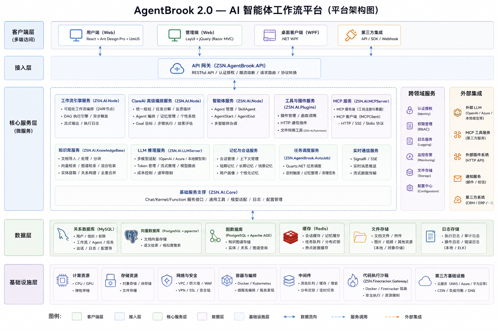
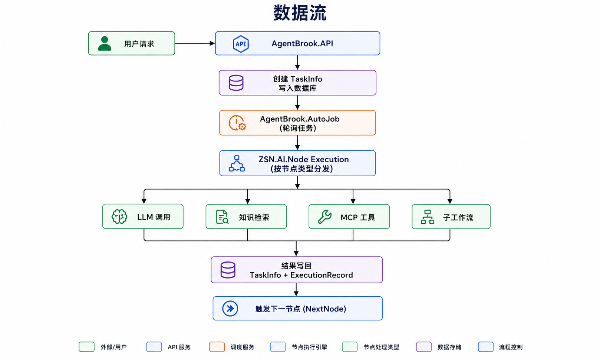
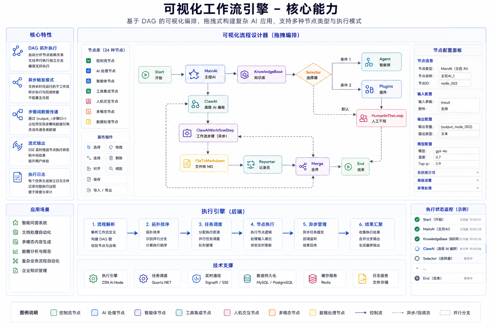
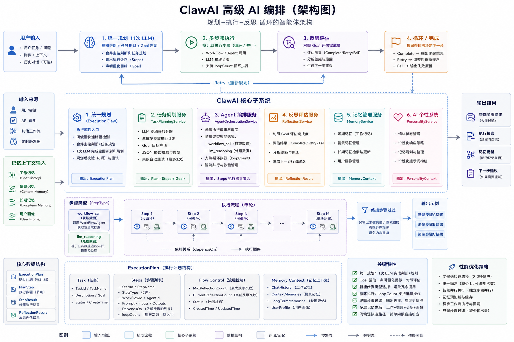
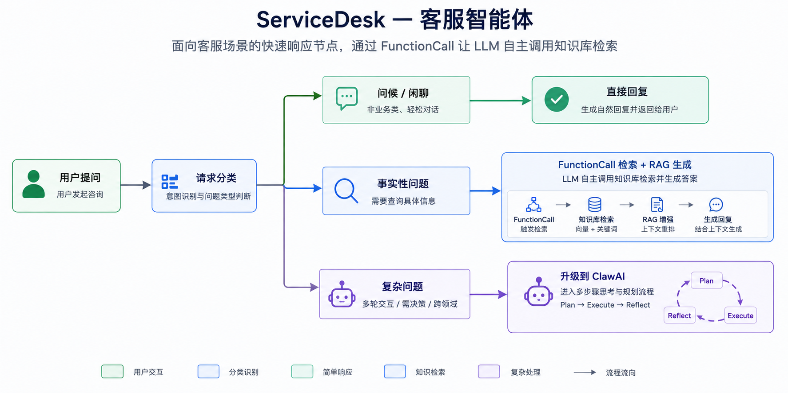
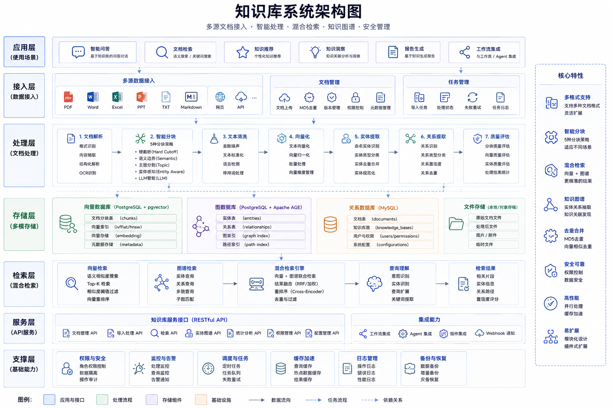
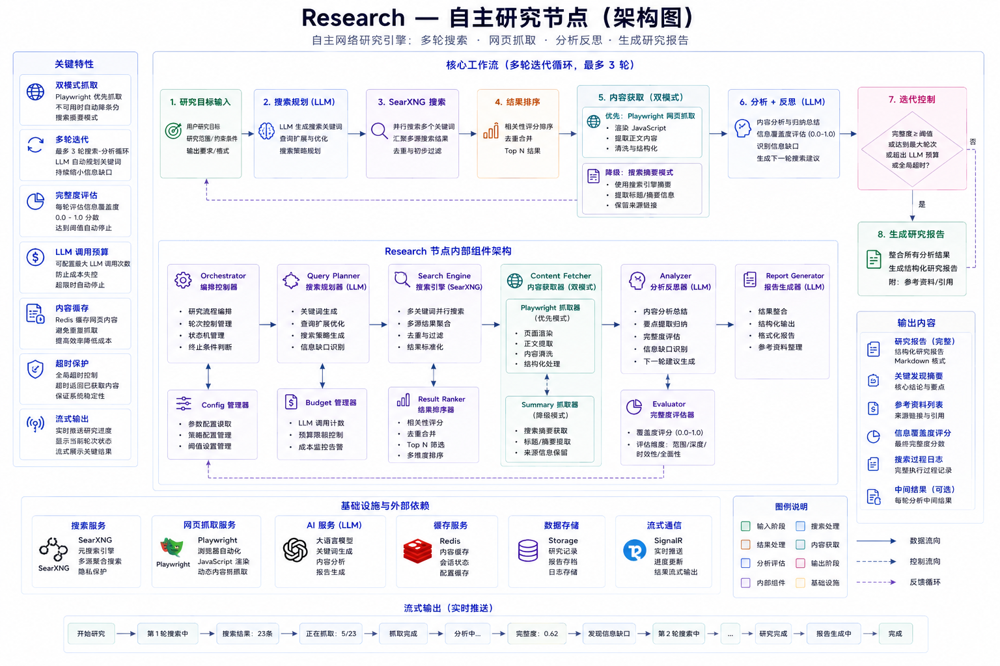
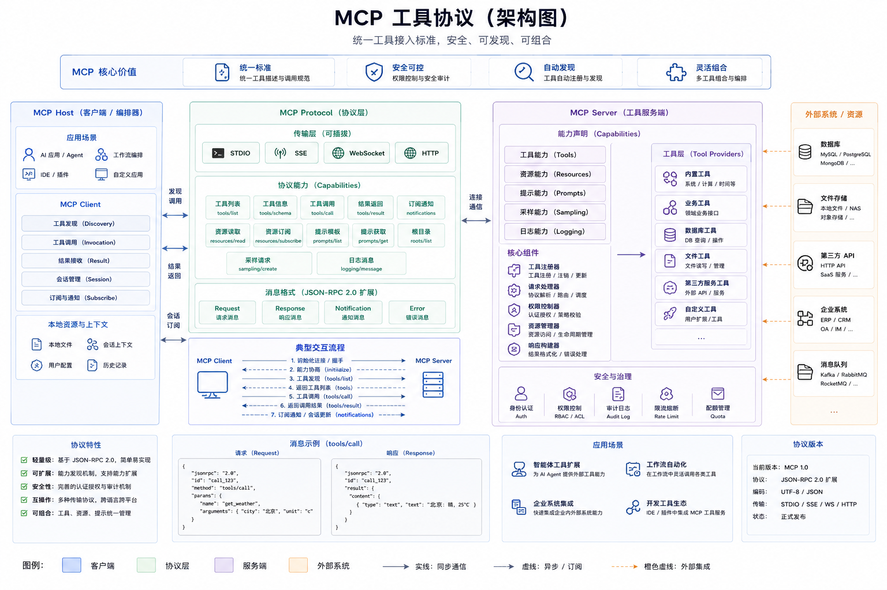
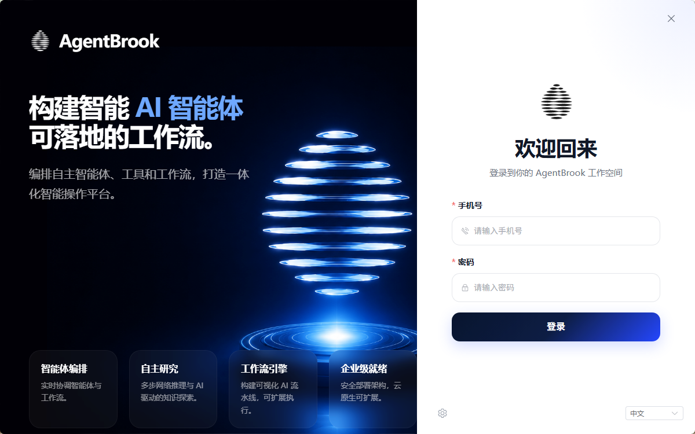
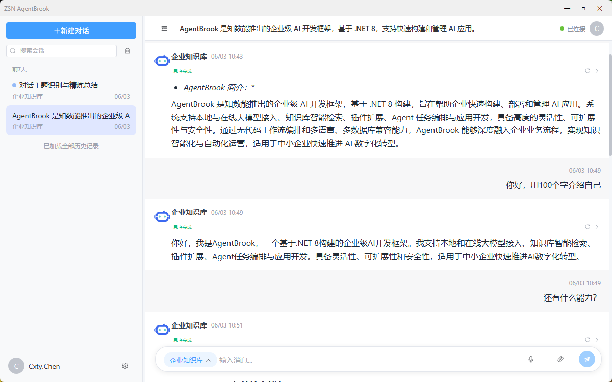

**中文** | [English](README_EN.md)

<div align="center">

# ZSN.AgentBrook

**企业级 AI 智能体编排平台**

可视化工作流编排 · 多模型智能体 · RAG 知识库 · MCP 工具集成

[](https://dotnet.microsoft.com/)
[](https://github.com/microsoft/semantic-kernel)
[](https://www.postgresql.org/)
[](https://github.com/pgvector/pgvector)
[](https://github.com/apache/age)
[](https://www.mysql.com/)
[](https://redis.io/)
[](https://react.dev/)
[](https://playwright.dev/)
[](https://www.docker.com/)
[](https://github.com/modelscope/FunASR)
[](https://github.com/searxng/searxng)
[](https://www.quartz-scheduler.net/)
[](LICENSE)
[](https://github.com/ChenGan666/ZSN.AgentBrook)
[](https://github.com/ChenGan666/ZSN.AgentBrook)

</div>

---

## 平台亮点

- **可视化 DAG 工作流引擎** — 拖拽式设计器，20+ 节点类型，支持条件分支、并行执行、人工审批、子工作流嵌套，**AI 自动生成下游节点链**
- **Message 消息节点** — 工作流驱动的 IM 消息发送节点，支持企业微信/钉钉/飞书/WhatsApp，Redis 队列异步解耦，批量发送与回执确认
- **MessageGateway 消息网关** — 统一 IM 消息收发网关，Webhook 接收 → 路由规则匹配 → 工作流触发，支持多渠道多规则编排
- **Voice 语音转写节点** — 语音识别 + LLM 后处理一体化，支持 FunASR 本地部署，说话人分离、多格式输出（SRT/VTT/JSON）、长音频自动分段、热词增强
- **ClawAI 智能体** — Plan-Execute-Reflect 循环架构，多层记忆系统（短期/长期/情景/人格/用户画像），支持任务分解与动态重规划
- **ServiceDesk 客服节点** — FunctionCall 驱动的知识库检索 + 生成一体化，支持多轮对话、意图识别、信息收集
- **Research 研究节点** — 自主网络研究，基于 SearXNG 搜索 + Playwright 网页抓取，多轮搜索-分析-反思迭代，自动生成研究报告
- **RAG 知识库** — 向量检索 + 全文检索混合搜索，支持 PDF/Word/Markdown 等多种文档格式，自动分块与索引，支持图片识别与图片输出
- **MCP 工具协议** — 内置 MCP Server/Client，快速接入外部工具和数据源
- **多模型支持** — OpenAI / Claude / DeepSeek / Ollama / 智谱 / 百度 等主流模型，可按节点独立配置
- **实时流式输出** — 基于 Redis Stream 的流式响应，前端实时展示 LLM 生成过程
- **跨平台客户端** — Vue3 + Tauri 桌面客户端，支持 SSE 流式对话、语音输入、文件上传、Human-in-the-loop 交互，Web SPA 模式开箱即用
- **浏览器自动化** — 基于 Playwright 的 Agent 浏览器，支持网页操作与数据采集

---

## 架构总览

[](https://agentbrook.com/)

### 数据流

[](https://agentbrook.com/)

### 核心模块依赖关系

```
AI.Entity ────────────────────────────────────── (基础数据模型，零依赖)
   │
   ├── AI.DAL ──── AI.DAL.MySql / AI.DAL.Postgres (数据访问抽象)
   │      │
   │      └── AI.BLL ──────────────────────────── (业务逻辑层)
   │             │
   │             ├── AI.Service ───────────────── (应用服务层)
   │             │
   │             └── AI.Node ◄── AI.Core ───────── (工作流引擎 + AI 内核)
   │                  │              │
   │                  │              ├── AI.Plugins (函数插件)
   │                  │              ├── AI.MCPClient (MCP 客户端)
   │                  │              └── AI.Functions (内置函数)
   │                  │
   │                  └── AI.KnowledgeBase ──────── (知识库服务)
   │
   ├── AgentBrook.API ────────────────────────── (API 网关，串联所有模块)
   │
   ├── AgentBrook.MessageGateway ───────────── (IM 消息网关)
   │
   ├── AgentBrook.AutoJob ────────────────────── (后台任务调度)
   │
   ├── AgentBrook.Client ──────────────────────── (跨平台客户端)
   │
   ├── AgentBrook.Web / Web.Manage ───────────── (前端界面)
   │
   └── Utils.Core / LitJSON / Cache ──────────── (通用工具库)
```

---

## 项目结构

| 项目 | 说明 | 关键技术 |
|---|---|---|
| **ZSN.AI.Core** | AI 内核，Semantic Kernel 封装，多模型路由，流式输出 | Semantic Kernel, Extensions.AI |
| **ZSN.AI.Node** | 工作流节点执行引擎，ClawAI / ServiceDesk / LLM 等全部节点 | SK FunctionCall, Pipeline |
| **ZSN.AI.Entity** | 数据模型、DTO、枚举定义 | SqlSugar 注解 |
| **ZSN.AI.BLL** | 业务逻辑层：工作流管理、任务调度、知识库操作 | |
| **ZSN.AI.DAL** | 数据访问抽象接口 | SqlSugar ORM |
| **ZSN.AI.DAL.MySql** | MySQL 数据访问实现 | SqlSugar + MySQL |
| **ZSN.AI.DAL.Postgres** | PostgreSQL 实现（向量检索 + 知识图谱） | Npgsql, pgvector, Apache AGE |
| **ZSN.AI.KnowledgeBase** | 知识库服务：文档导入、分块、索引、语义检索、图片识别 | Npgsql, pgvector, Apache AGE |
| **ZSN.AI.MCPServer** | MCP 工具服务器，将平台能力暴露为 MCP 工具 | ModelContextProtocol |
| **ZSN.AI.MCPClient** | MCP 客户端，连接外部 MCP 服务 | ModelContextProtocol |
| **ZSN.AI.Plugins** | Semantic Kernel 函数插件集合 | |
| **ZSN.AI.Functions** | 内置函数库 | |
| **ZSN.AgentBrook.API** | REST API 网关，Swagger 文档 | ASP.NET Core, SignalR |
| **ZSN.AgentBrook.MessageGateway** | 统一 IM 消息网关，多渠道 Webhook 接收与路由 | ASP.NET Core, Redis Queue |
| **ZSN.AgentBrook.Client** | 跨平台客户端（Vue3 + Tauri / Web SPA） | Vue3, TypeScript, Element Plus, Tauri |
| **ZSN.AgentBrook.Web** | 前端界面（React + Ant Design Pro） | React, Ant Design Pro |
| **ZSN.AgentBrook.Web.Manage** | 管理后台（LayUI）：应用/模型/知识库/会话管理/菜单配置等 | LayUI, jQuery |
| **ZSN.AgentBrook.AutoJob** | 后台任务调度器，轮询执行工作流任务 | Quartz.NET |
| **ZSN.AgentBrook.Plugins** | 应用级插件 | |
| **ZSN.AgentBrowser** | AI 浏览器自动化 | Playwright |
| **ZSN.Cache** | 分布式缓存服务 | Redis, MemoryCache |
| **ZSN.Utils.Core** | 通用工具库 | log4net, NPOI |
| **LitJSON** | 轻量 JSON 库 | |

---

## 核心能力

### 1. 可视化工作流引擎

基于 DAG（有向无环图）的可视化工作流编辑器，支持拖拽设计：

[](https://agentbrook.com/)


**支持 20+ 节点类型：**

| 类别 | 节点 |
|---|---|
| 流程控制 | Start, End, AgentStart, AgentEnd |
| AI 推理 | MainAI, LargeModel, ClawAI, ServiceDesk, Research, Voice, Message |
| 知识检索 | KnowledgeBase, FileToMarkdown |
| 逻辑路由 | Selector（条件分支）, Merge（汇聚）, IntentionRecognition（意图识别） |
| 工具集成 | MCP, Plugins, Agent（子工作流） |
| 人机协作 | HumanInTheLoop（人工审批）, Reporter（报告生成） |
| 触发器 | TimeTrigger（定时触发） |

**AI 自动生成下游节点链：**

在工作流编辑器中选中任意节点，输入自然语言需求，AI 将自动规划、生成并组装完整下游节点链：

- **三阶段流水线**：规划工作流结构 → 并行生成节点详情 → 工程组装，通过 SSE 实时推送进度
- **智能变量映射**：自动解析上游上下文中的可用变量，为下游节点精准匹配 sourceId 引用
- **兼容现有工作流**：保留上游节点不变，仅生成新的下游节点和连线，自动布局与 DAG 环路检测
- **提示词模板可定制**：内置 AutoGeneratePlan 和 ModifyNodeDetail 提示词模板，可通过 md 文件自定义 AI 行为

### 2. ClawAI — 高级智能体

ClawAI 是平台的核心智能体节点，实现了完整的 **Plan-Execute-Reflect** 循环：

[](https://agentbrook.com/)


**多层记忆系统：**

| 记忆层 | 作用 |
|---|---|
| 短期记忆 | 当前会话上下文，保持对话连贯性 |
| 情景记忆 | 历史事件记录，跨会话经验积累 |
| 长期记忆 | 知识库检索结果，持久化知识存储 |
| 用户画像 | 用户偏好与行为特征，个性化服务 |
| AI 人格 | AI 角色状态，维持一致的交互风格 |

**多模型协作：** 每个环节可独立配置模型（主模型、规划模型、反思模型、记忆模型、人格模型），实现成本与效果的灵活平衡。

### 3. ServiceDesk — 客服智能体

面向客服场景的快速响应节点，通过 FunctionCall 让 LLM 自主调用知识库检索：

[](https://agentbrook.com/)


**核心特性：**
- FunctionCall 驱动：LLM 自主决定是否检索知识库
- 多轮对话：自动维护会话上下文
- 信息收集：检测意图后自动追问缺失字段
- 置信度分级：高/中/低置信度对应不同处理策略
- 来源引用：回答附带知识库来源标注

### 4. RAG 知识库

[](https://agentbrook.com/)


- **混合检索**：向量语义搜索 + 全文关键词搜索，融合排序
- **知识图谱**：基于 Apache AGE 的实体关系图谱
- **多格式支持**：PDF、Word、Markdown、TXT、HTML 等
- **智能分块**：语义感知的文档分块策略
- **图片识别**：自动提取文档中的图片，通过 VLM（视觉语言模型）生成图片描述、OCR 文字识别，支持 PDF/Word/PPT 文档
- **图片输出**：知识库检索结果支持返回关联图片，图片与文本分块自动关联，支持混合图文检索

**图片处理管线：**

```
文档上传 → 图片提取（PDF/Word/PPT）
    → 内容去重（SHA256 哈希）
    → VLM 描述生成（图片描述 + OCR + 标签）
    → 图片存储 + 元数据入库
    → 图片-分块自动关联
```

### 5. Research — 自主研究节点

Research 节点是一个自主网络研究引擎，能够根据研究目标自动进行多轮搜索、网页抓取、分析和反思：

[](https://agentbrook.com/)


**关键特性：**
- **双模式抓取**：Playwright 网页抓取优先，不可用时自动降级为搜索摘要模式
- **多轮迭代**：最多 3 轮搜索-分析循环，LLM 自动规划关键词
- **完整度评估**：每轮分析后评估信息覆盖度（0.0-1.0），达到阈值后自动停止
- **LLM 调用预算**：可配置最大 LLM 调用次数，防止成本失控
- **内容缓存**：基于 Redis 的网页内容缓存，避免重复抓取
- **超时保护**：全局超时保护，超时返回已获取内容
- **流式输出**：实时流式推送研究进度

### 6. Voice — 语音转写节点

Voice 节点是集语音识别与 LLM 后处理于一体的智能语音处理节点，支持从音频文件自动生成结构化文本：

**核心能力：**
- **语音转写**：基于 FunASR（WebSocket 离线模式）的本地化语音识别，数据不出服务器
- **说话人分离**：自动识别不同发言人，支持自定义说话人标签映射
- **多格式输出**：纯文本、带时间戳分段 JSON、SRT 字幕、WebVTT 字幕
- **LLM 后处理**：转写结果自动接入 LLM，支持自定义提示词进行文本整理、摘要生成等
- **长音频分段**：超过阈值（默认 300 秒）的音频自动按静音检测分段，并行转写后合并
- **热词增强**：支持配置热词列表，提升特定领域词汇识别率
- **多格式输入**：WAV、MP3、M4A、OGG、FLAC、AAC 等 12 种音频/视频格式，FFmpeg 自动转换

**处理流程：**

```
音频输入 → 格式转换（FFmpeg）
    → 长音频 VAD 分段（silencedetect）
    → FunASR WebSocket 转写（分片发送）
    → 说话人标签映射 + 输出格式化
    → LLM 后处理（可选）
    → 结构化结果输出
```

**配置示例（appsettings.json）：**

```json
{
  "VoiceNodeOptions": {
    "DefaultProvider": "FunASR",
    "MaxConcurrentSegments": 4,
    "MaxFileSizeMb": 500,
    "AutoSegmentThresholdSeconds": 300,
    "TempFileDirectory": "",
    "FFmpegPath": ""
  },
  "FunASROptions": {
    "ServerUrl": "ws://127.0.0.1:10095",
    "ChunkSize": 9600,
    "ConnectTimeoutSeconds": 5,
    "TranscribeTimeoutMinutes": 10
  }
}
```

### 7. Message — 消息发送节点

Message 节点使工作流能够主动发送 IM 消息，支持多渠道集成和灵活的发送策略：

**核心特性：**
- **多渠道支持**：企业微信、钉钉、飞书、WhatsApp，通过 MessageGateway 统一适配
- **多用户模式**：Static（手动指定）/ Dynamic（上游变量）/ Query（查询，预留），支持批量独立发送
- **占位符替换**：消息模板支持 `{{input}}`、`{{变量名}}` 等占位符，自动替换为工作流上下文变量
- **发送确认**：支持 WaitForConfirmation 模式，轮询等待网关确认发送结果后再触发下游
- **Redis 解耦**：通过 Redis 队列与 MessageGateway 异步通信，节点不直接调用 IM API
- **个人化消息**：支持为每个目标用户覆盖消息内容，实现个性化推送

**处理流程：**

```
工作流 → MessageNode → Redis 入队 (msg_send_queue)
    → MessageGateway 消费者出队
    → 查找渠道配置 → Provider 实例化
    → Token 刷新 / 签名计算 → IM API 发送
    → 结果写回 tb_msg_send_record
    → (WaitForConfirmation 模式) Node 轮询确认
```

**配置示例（appsettings.json）：**

```json
{
  "MessageNode": {
    "SendQueueName": "msg_send_queue",
    "WaitTimeoutSeconds": 30,
    "PollIntervalMs": 500
  }
}
```

### 8. MessageGateway — 消息网关

MessageGateway 是独立的 IM 消息网关服务，负责接收和发送 IM 消息：

**接收流向（IM → 工作流）：**
- Webhook 接收 IM 平台回调 → 渠道签名验证 → 消息解析 → 幂等去重 → 路由规则匹配 → 创建工作流任务

**发送流向（工作流 → IM）：**
- Redis 队列消费 (msg_send_queue) → 渠道配置查找 → Provider 获取/熔断保护 → 重试机制 → 结果回写

**路由规则：**
- 支持 All / Keyword / Regex 多种匹配类型
- 优先级排序，第一条命中的规则生效
- 自动创建会话、临时会员（确定性 MemberID）
- 支持自定义 inputs 映射到工作流变量

**熔断保护：**
- 可配置连续失败阈值，自动熔断 Provider
- 熔断后自动恢复（可配置恢复时间）

### 9. MCP 工具集成

[](https://agentbrook.com/)

内置 MCP Server 和 Client，支持：
- 将平台能力（知识库检索、工作流触发等）暴露为 MCP 工具
- 连接外部 MCP 服务，扩展 LLM 工具能力
- 支持客户端/服务端双向调用模式

### 10. 跨平台客户端 (ZSN.AgentBrook.Client)

基于 Vue3 + TypeScript + Element Plus + Tauri 的跨平台客户端，支持 Web SPA 和桌面应用两种部署模式：

**核心特性：**
- **双模式部署** — Tauri 桌面应用（Windows/macOS）+ Web SPA（.NET 宿主），一份前端代码两种部署
- **SSE 流式对话** — 实时展示 LLM 生成过程，支持工作流节点状态展示
- **语音输入** — FunASR 2pass 实时语音识别，Tauri 原生音频采集
- **文件上传** — 多格式支持，大文件分片上传，图片压缩
- **Human-in-the-loop** — 工作流人工审批交互
- **国际化** — 内置中英文切换，可扩展更多语言
- **系统通知** — 会话完成时桌面/Web 系统通知，多会话短窗口聚合去重，跨心跳与 SSE 防重复推送；Windows 自动适配 AppUMID 修复通知不显示，设置中可一键测试
- **本地缓存** — IndexedDB 存储会话消息，离线队列支持
- **安全机制** — Token 加密存储，API 请求签名，XSS 防护

[](https://agentbrook.com/)
[](https://agentbrook.com/)


**技术架构：**

```
ZSN.AgentBrook.Client/
├── Program.cs              # .NET 宿主（SPA 静态文件服务）
├── appsettings.json        # Kestrel 配置
├── wwwroot/                # Vue3 构建产物（SPA 模式）
└── client-app/             # Vue3 前端源码
    ├── src/
    │   ├── views/          # 页面（Login, Chat, Settings, MeetingTranscribe, MiniChat）
    │   ├── components/     # 组件（chat, layout, settings, common）
    │   ├── composables/    # 组合式函数（useAuth, useChat, useVoice, useFileUpload）
    │   ├── services/       # API 服务（http, auth, chat, session, hitl, voiceApi）
    │   ├── stores/         # Pinia 状态管理
    │   ├── platform/       # 平台适配层（Tauri / Web）
    │   └── utils/          # 工具函数（cache, crypto, db, markdown）
    └── src-tauri/          # Tauri 桌面端配置
```

**运行客户端：**

```bash
# Web SPA 模式（开箱即用）
dotnet run --project ZSN.AgentBrook.Client
# 访问 http://localhost:5006

# 开发模式（前端热重载）
cd ZSN.AgentBrook.Client/client-app
npm install
npm run dev

# Tauri 桌面端开发
cd ZSN.AgentBrook.Client/client-app
npm run tauri:dev
```

### 11. 多模型支持

通过统一的 `IChatService` 接口对接多种 AI 提供商：

| 提供商 | 模型示例 | 接入方式 |
|---|---|---|
| OpenAI | GPT-4o, GPT-4, GPT-3.5 | OpenAI API |
| Anthropic | Claude 系列 | OpenAI 兼容接口 |
| DeepSeek | DeepSeek-V3/R1 | OpenAI 兼容接口 |
| Ollama | Qwen, Llama, Mistral 等本地模型 | Ollama API |
| 智谱 AI | GLM-4 | 智谱 API |
| 百度 | 文心一言 | 百度 API |
| 其他 | 任何 OpenAI 兼容接口 | 自定义 EndPoint |

每个工作流节点可独立配置模型、Temperature、TopP 等参数。

---

## 技术栈

| 层级 | 技术 |
|---|---|
| **运行时** | .NET 10 |
| **AI 框架** | Microsoft Semantic Kernel 1.74, Microsoft.Extensions.AI 10.4 |
| **MCP** | ModelContextProtocol 0.3 |
| **ORM** | SqlSugar 5.1 |
| **数据库** | MySQL（主库）, PostgreSQL + pgvector + Apache AGE（知识库） |
| **缓存** | Redis (StackExchange.Redis) |
| **文档处理** | PdfPig, OpenXml, Markdig, ImageSharp |
| **图片处理** | VLM 图片描述, OCR 文字识别, 图片-分块关联 |
| **任务调度** | Quartz.NET |
| **前端** | React + Ant Design Pro（用户端）, LayUI（管理端）, Vue3 + Element Plus + Tauri（客户端） |
| **浏览器自动化** | Playwright |
| **API 文档** | Swagger / OpenAPI |

---

## 快速开始

### 环境要求

- .NET 10 SDK
- MySQL 8.0+
- PostgreSQL 16+（知识库功能，需安装 pgvector 扩展）
- Redis 7.0+

### 安装步骤

```bash
# 克隆仓库
git clone https://github.com/your-org/ZSN.AgentBrook.git
cd ZSN.AgentBrook

# 还原依赖
dotnet restore ZSN.AI.sln
```

### 配置

编辑 `ZSN.AgentBrook.API/appsettings.json`：

```json
{
  "ConnectionStrings": {
    "DefaultConnection": "Server=localhost;Database=zsn_ai;Uid=root;Pwd=your_password;",
    "PostgresConnection": "Host=localhost;Database=zsn_kb;Username=postgres;Password=your_password;"
  },
  "Redis": {
    "ConnectionString": "localhost:6379"
  },
  "LLM": {
    "DefaultModelId": 1
  }
}
```

### 运行

```bash
# 启动 API 服务
dotnet run --project ZSN.AgentBrook.API

# 启动后台任务调度（工作流执行）
dotnet run --project ZSN.AgentBrook.AutoJob

# 启动消息网关（IM 消息收发，可选）
dotnet run --project ZSN.AgentBrook.MessageGateway

# 启动管理后台（可选）
dotnet run --project ZSN.AgentBrook.Web.Manage

# 启动客户端（Web SPA 模式，可选）
dotnet run --project ZSN.AgentBrook.Client
```

---

## Demo

### 多图推文生成

[](https://agentbrook.com/)

[](https://agentbrook.com/)

[](https://agentbrook.com/)

[](https://agentbrook.com/)


### 绘本生成

[](https://agentbrook.com/)

[](https://agentbrook.com/)

[](https://agentbrook.com/)

[](https://agentbrook.com/)

[](https://agentbrook.com/)

[](https://agentbrook.com/)

[](https://agentbrook.com/)

### AI客服-知识库

[](https://agentbrook.com/)

[](https://agentbrook.com/)

[](https://agentbrook.com/)

---

## 许可证

本项目基于 [MIT License](LICENSE) 开源。